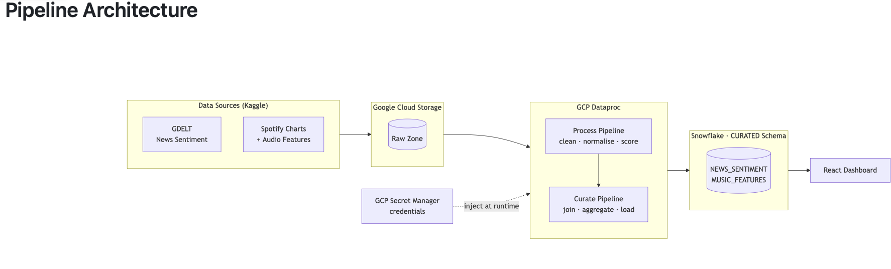
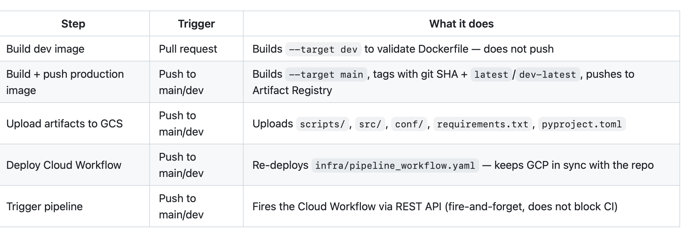
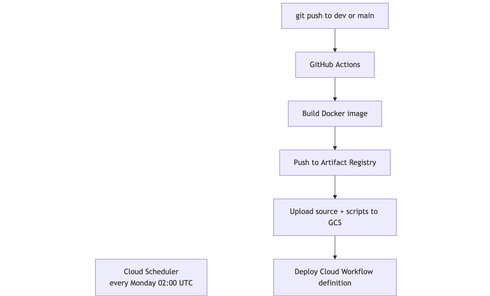
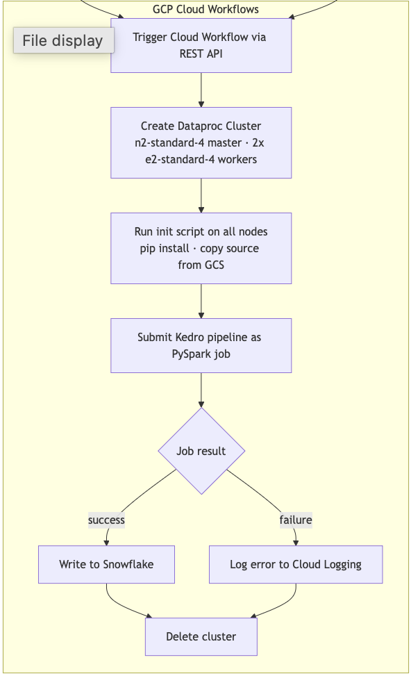
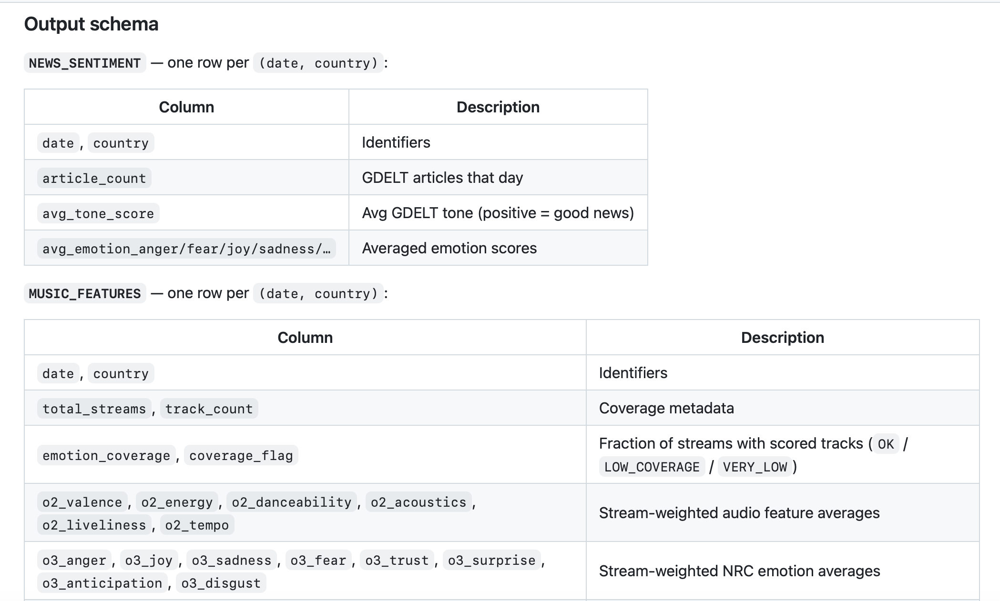

<p align="center">
  <h1 align="center">🎵 Society-to-Music Analytics</h1>
  <h3 align="center">
    Understanding How Global News Sentiment Shapes Music Listening Behavior
  </h3>
</p>

<p align="center">
  End-to-end analytics platform exploring how global news sentiment influences music consumption patterns across countries and time.
</p>

<p align="center">


</p>

# 🌍 Project Overview

This project investigates the relationship between global news sentiment and music listening behavior using large-scale distributed data pipelines and cloud infrastructure.

By integrating worldwide news sentiment signals with Spotify streaming and audio feature datasets, this platform uncovers how emotional patterns in global events may influence listener behavior across countries and time.

The platform was designed as a scalable cloud-native analytics system capable of processing high-volume datasets using PySpark, GCP, Snowflake, and modern CI/CD automation workflows.

# ✨ Key Features

✅ Distributed ETL pipelines with PySpark  
✅ Automated cloud workflows using GCP  
✅ Snowflake-powered analytics warehouse  
✅ CI/CD deployment automation using GitHub Actions  
✅ FastAPI backend architecture  
✅ React-based frontend integration  
✅ Large-scale sentiment and audio feature processing  
✅ Automated cloud execution and orchestration  

# 🧠 Core Analytics Questions

- How does global news sentiment influence music mood and listening behavior?
- Do countries react differently to emotional news events?
- Can shifts in sentiment predict changes in audio feature trends?
- How do emotional categories like joy, anger, fear, and sadness correlate with streaming behavior?

# 🏗️ Platform Architecture

<p align="center">
  
</p>

# ⚡ CI/CD Automation

<p align="center">
  
</p>

# 🔄 Infrastructure Formation Workflow

<p align="center">
  
</p>

# 🚀 CI/CD Workflow Execution

<p align="center">
  
</p>

# 📊 Data Pipeline Execution

<p align="center">
  
</p>

# 🛠️ Tech Stack

| Category | Technologies |
|---|---|
| Programming | Python, SQL |
| Distributed Processing | PySpark |
| Cloud Platform | Google Cloud Platform (GCP) |
| Data Warehouse | Snowflake |
| Backend API | FastAPI |
| Frontend | React + Vite |
| Orchestration | Kedro |
| CI/CD | GitHub Actions |
| Storage | Google Cloud Storage |
| Infrastructure | Cloud Workflows, Dataproc |
| Local Development | DuckDB |

# ⚙️ Pipeline Workflow

### Data Sources
- GDELT Global News Dataset
- Spotify Charts Dataset
- Spotify Audio Features Dataset

### Processing Flow
1. Raw data ingestion
2. Data cleaning and validation
3. Sentiment aggregation
4. Audio feature engineering
5. Country-level joins and aggregations
6. Warehouse loading
7. API integration
8. Frontend visualization

# ☁️ Cloud Architecture

The platform supports both:
- Local execution using DuckDB
- Production cloud execution using GCP + Snowflake

Production workflows include:
- Automated image builds
- Cloud workflow deployment
- Artifact uploads
- Scheduled pipeline execution
- Secret Manager integration
- CI/CD orchestration

# 📈 Production Features

✅ Automated GitHub Actions deployment  
✅ Cloud Run integration  
✅ Secret Manager credential handling  
✅ Dataproc distributed execution  
✅ Scheduled workflow automation  
✅ Containerized infrastructure  

# 🧩 Repository Structure

```bash
src/
 ├── pipelines/
 ├── process/
 ├── curate/
 ├── hooks.py
 ├── settings.py

conf/
 ├── base/
 ├── local/

scripts/
 ├── dataproc_init.sh
 ├── dataproc_run.py

infra/
 ├── pipeline_workflow.yaml

app/
 ├── frontend/
 ├── backend/
```

# 🚀 Running the Project Locally

```bash
make run-local
```

Run frontend:

```bash
cd app
npm install
npm run dev
```
# ☁️ Running in Production

Trigger via GitHub push:

```bash
git push origin main
```

Or manually:

```bash
gcloud workflows run run-pipeline
```

# 📌 Highlights

- Built scalable distributed ETL pipelines
- Integrated multi-source global datasets
- Designed production-grade cloud workflows
- Automated deployment pipelines
- Implemented cloud-native analytics architecture
- Engineered large-scale sentiment processing system

# 👩‍💻 Author

### Prarthana Patel

MSBA Candidate — UCLA Anderson School of Management

Passionate about:
- Data Analytics
- Product Analytics
- Cloud Data Engineering
- Consumer Insights
- AI-driven Analytics Systems


